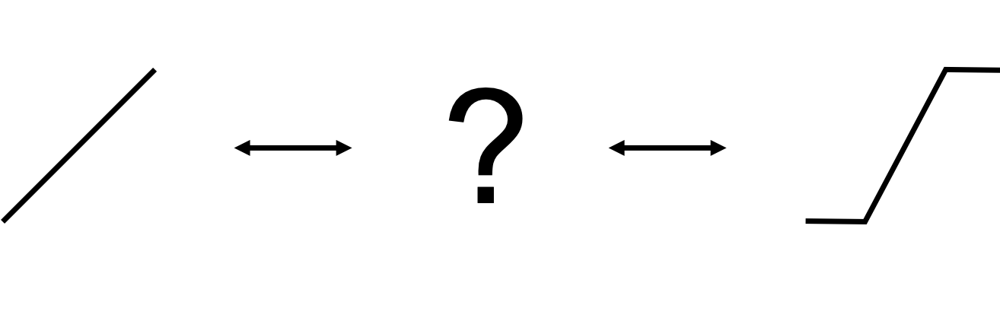
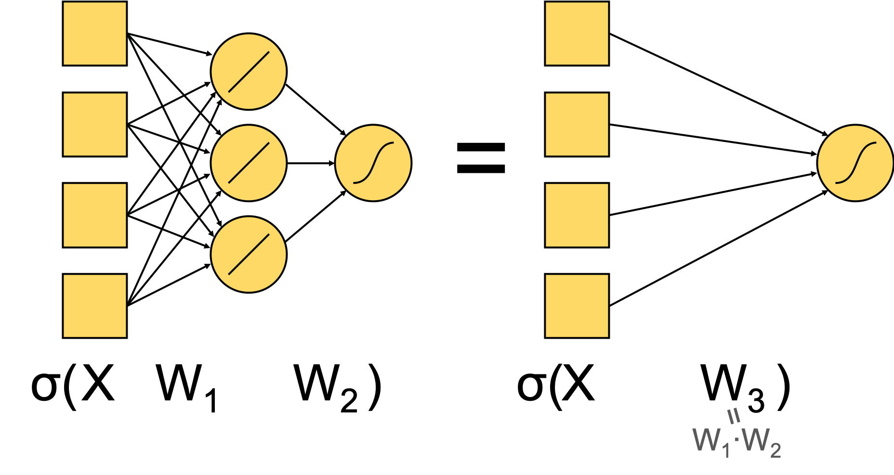
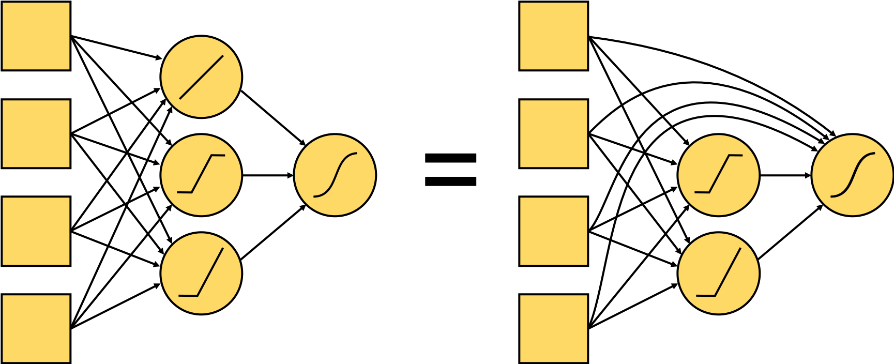

# Parametric piecewise linear (PPwL) activation functions

A mix of the non-linearity of a hard sigmoid activation function and the
flexibility of a parametric leaky relu. When the nodes are initialized, the
activations are linear. I.e., we can initialize a very deep network which acts
as linear or logistic regression (depending on the activation of the output
nodes). The network can then learn the shape of the activation function,
allowing for linear, (leaky) relu, hard sigmoid, or something in between.

### Dependencies
   - Python 3.7
   - Keras
   - Numpy
   - Tensorflow
   
See ``PPwL_activation.ipynb`` for illustration. 

## The original idea

Neural networks with linear activations in the hidden layers can be summarized into smaller networks.

The network could learn its optimal architecture by tuning the shape of its activation
functions. Those nodes with activation functions that are approximately linear at the end of the
training can be dropped.

