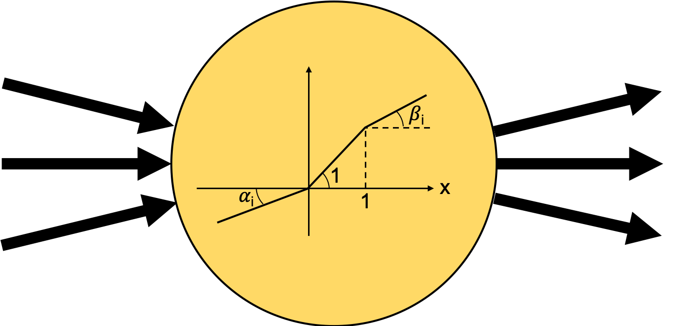

# Aside

There are things that I need to try out that probably won't lead anywhere. This
is where I keep them.

## Parametric piecewise linear (PPwL) activation functions [(here)](https://github.com/lpupp/Aside/tree/master/PPwL_activation)

**Idea:** allow the network to determine its optimal architecture
by learning the shape of PPwL activation functions, which are initialized linearly. After training,
some of the PPwL parameters (those close to linear) should be truncated.

PPwL is a mix between the non-linearity of a hard sigmoid activation function and the
flexibility of a parametric leaky relu. When the nodes are initialized, the
activations are linear. I.e., we can initialize a very deep network which acts
as linear or logistic regression (depending on the activation of the output
nodes). The network can then learn the shape of the activation function,
allowing for linear, (leaky) relu, hard sigmoid, or something in between.

